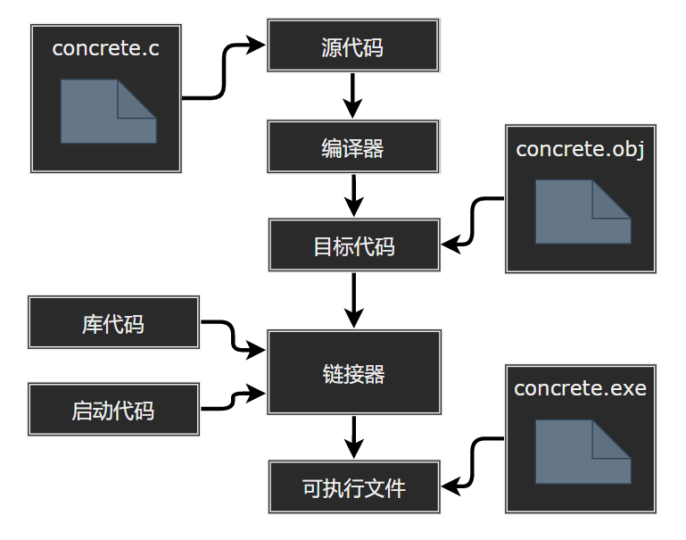

## C 环境与编译

- [C 环境与编译](#c-环境与编译)
	- [源文件编程过程中出现的文件类型](#源文件编程过程中出现的文件类型)
	- [环境](#环境)
		- [翻译环境与翻译阶段](#翻译环境与翻译阶段)
		- [执行环境](#执行环境)
	- [编译器与链接器](#编译器与链接器)
	- [语言编译过程](#语言编译过程)
		- [预处理阶段](#预处理阶段)
		- [编译阶段](#编译阶段)
		- [汇编阶段](#汇编阶段)
		- [链接阶段](#链接阶段)
	- [C 语言编译环境](#c-语言编译环境)
		- [GNU 编译器](#gnu-编译器)
		- [UNIX 系统](#unix-系统)
		- [Linux 系统](#linux-系统)
		- [PC 的命令行编译器](#pc-的命令行编译器)
		- [集成开发环境（windows）](#集成开发环境windows)
	- [编译多源代码文件的程序](#编译多源代码文件的程序)
		- [UNIX](#unix)
		- [Linux](#linux)
		- [DOS 命令行编译器](#dos-命令行编译器)
		- [Windows 和 Mac IDE 编译器](#windows-和-mac-ide-编译器)
		- [使用头文件](#使用头文件)
		- [查看程序退出状态](#查看程序退出状态)

---
### 源文件编程过程中出现的文件类型

|file|description|
|:--|:--|
|头文件 `*.h`|C/C++ 程序通常由头文件（header files，```*.h```）和其源文件组成，以作为一种包含功能函数、数据接口声明的载体文件，来保存程序的声明；源代码文件用于保存程序的实现。|
|源代码文件 `*.c`|用 C 语言编写程序时，编写的内容被储存在文本文件中，该文件被称为源代码文件（source code files，```*.c```）。|
|目标代码文件 `*.o`|编译器把源代码转换为机器语言代码，并把结果放在与源文件相同名称的目标代码文件中，拓展名为 ```*.o```，不能直接运行。目标代码文件缺失启动代码 (startup code)，启动代码充当着程序和操作系统之间的接口。|
|库文件|目标代码还缺少库函数，几乎所有的 C 程序都要使用 C 标准库中的函数。当生成完整的可执行程序，之后会将中间代码的目标代码文件删除。<br><br>`helloworld.c` 中就使用了 ```printf()``` 函数。目标代码文件并不包含该函数的代码，它只包含了调用 ```printf()``` 函数的指令。```printf()``` 函数真正的代码储存在另一个被称为库的文件中。库文件中有许多函数的目标代码。|
|可执行文件|可执行文件（executable file）指的是可以由操作系统进行加载执行的文件。在 win 系统下，可执行程序可以是 ```*.exe```、```*.sys```、```*.com``` 等类型文件。C 程序由 C 源文件经 C 编译器编译生成。|

>---
### 环境

#### 翻译环境与翻译阶段

一个 C 程序不需要同时翻译所有程序，程序的文本以称为源文件（或预处理文件）的单元保存。源文件以及通过预处理指令 `#include` 包含的所有头文件和源文件称为预处理翻译单元。预处理翻译单元称为翻译单元。已翻译的翻译单元可以单独保存，也可以保存在库中。程序的单独翻译单元通过调用具有外部链接的函数标识符、操作具有外部链接的对象标识符或操作数据文件进行通信。翻译单元可以单独翻译，然后通过链接生成可执行程序。

如果预处理翻译单元或翻译单元包含违反任何语法规则或约束的内容，则符合要求的实现应至少生成一条诊断消息（以实现定义的方式标识），即使该行为也被显式指定为未定义或实现定义。在其他情况下不需要生成诊断消息。链接器会解析所有外部引用，并通过将一个或多个单独处理的翻译单元与标准库组合在一起来创建可执行程序或 DLL。

1. 字符映射：物理源文件中多字节字符以实现定义的方式映射到 **内部源表示形式**（源字符集，包含空白字符、英文、数字与 29 个标点符号共 96 个字符，为行尾指示符引入换行符）。在此阶段，三元组序列（又称三标符）将转换为单字符内部表示形式。
<br>

2. 行拼接：删除紧跟在换行符的反斜杠 `\` 的每个实例，拼接物理源行以形成逻辑源行。只有任何物理源行上的最后一个反斜杠才有资格称为此类拼接的一部分。不为空的源文件应以换行符结尾，在进行任何此类拼接之前，换行符前面不应紧跟反斜杠字符。
<br>

3. 词汇切分：词汇分析时分为 **预处理令牌分析** 和 **空白字符替换注释**。源文件不得以部分预处理令牌或部分注释结尾，每个注释将逐一替换为空白字符，并将所有注释从程序中移除。保留换行符。除换行符以外的每个非空空格字符序列是保留还是替换为一个空格字符，都是由实现定义的。预处理标记有头文件名、预处理标识符、预处理常量、预处理运算符、不属于任何其他类别的单独非空白字符。<br>
词汇分析时可能会出现 **最大吞噬现象**（maximal munch）：若已经分析输入为到给定字符为止的预处理记号，则通常将能构成一个预处理记号的最长字符序列处理成下个预处理记号，即这会导致后继分析失败。

	```c
	int foo = 1;
	int bar = 0xE+foo;   	// ERROR: 非法的预处理数字 0xE+foo
	int baz = 0xE + foo;

	int quux = bar+++++baz; // ERROR: bar++ ++ +baz，而非 bar++ + ++baz
	```
<br>

4. 预处理：执行预处理指令，扩展宏调用，并执行一元运算符表达式。如果通过标记串联生成与通用字符名称语法匹配的字符序列，则行为未定义。`#include` 预处理指令导入的命名头文件或源文件按第 1 阶段到第 4 阶段递归进行处理。然后删除所有预处理指令。
<br>

5. 字符集映射：字符常量和字符串文本中的每个源字符集成员和转义序列都转换为执行字符集的相应成员。没有相应成员的源字符或转义序列的每个实例都以实现定义的方式转换为执行字符集的某些成员，而不是 null（宽）字符。对于 Microsoft C 和 C++，源和执行字符集都为 ASCII。
<br>

6. 字符串串联：所有相邻字符串和宽字符串文本是串联的。例如，```"String ""concatenation"``` 串联为 `"String concatenation"`。
<br>

7. 翻译：分隔令牌的空格字符不再重要。每个预处理令牌都转换为一个令牌。生成的令牌在句法和语义上被分析并翻译为翻译单元。
<br>

8. 链接：解析所有外部对象和函数引用。库组件被链接起来，以满足对当前翻译中未定义的函数和对象的外部引用。所有这些转换器输出都被收集到一个程序图像中，该图像包含在其执行环境中执行所需的信息。

如果预处理翻译单元或翻译单元违反任何语法规则或约束的内容，则符合要求的实现将至少生成一条诊断消息，即使该行为被显式指定为未定义或实现定义。


>---
#### 执行环境

定义了两种执行环境：独立式和托管式。在这两种情况下，当执行环境调用指定的 C 函数时，都会发生程序启动。所有具有静态存储持续时间的对象都应在程序启动前初始化（设置为其初始值），这种初始化的方式和时间没有具体说明。程序终止时将控制权返回给执行环境。

**独立式环境**：在独立环境中（C 程序执行可能在没有任何操作系统优势的情况下进行），程序启动时调用的函数的名称和类型是实现定义的。除了 C 标准要求的最小集外，可用于独立程序的任何库基础都是由实现定义的。在独立环境中，程序终止的效果由实现定义。

**托管式环境**：无需提供托管环境，但应符合以下规范（如果存在）。

> *程序启动*

程序启动时调用 `main` 函数，该实现没有声明此函数的原型，它可以以 `int` 作为返回类型，可以不带参数：

```c
int main(void) { /* ... */ }
int main(int argc, char* argv[]) { /* ... */ }
```

或其他等价的声明或其他实现定义的方式。

```c
void main(void)  { /* ... */ }
void main(int argc, char* argv[])  { /* ... */ }
//... e.g.
```

> *程序执行*

在托管环境中，程序可以使用标准库中描述的所有函数、宏、类型定义和对象。

> *程序终止*

如果 `main` 函数的返回类型是与 `int` 兼容的类型，则初始调用 `main` 函数的返回等同于以 `main` 函数返回的值作为其参数调用 `exit` 函数；到达终止 `main` 函数的 `}` 将返回值 0。如果返回类型与 `int` 不兼容，则返回到主机环境的终止状态为未指定。

```c
int main() {
	//...
	return 0
	// == exit(0)
}
```

>---
### 编译器与链接器

**编译器**：C 编程的基本策略是，用程序将源代码文件转换为可执行文件（包含可直接运行的机器语言代码）。编译器把源代码转换成中间代码，链接器把中间代码和其他代码合并生成可执行文件。C 通过这种方式对程序进行模块化，可以独立编译单独的模块，稍后再用链接器合并已编译的模块。利用这种方式，只编译发生更改的某个模块，而不必重新编译其他模块。

**链接器**：链接（Link）实际是一个 “打包” 的过程，它将所有二进制形式的 **目标文件**（程序的目标代码和依赖的库文件）和 **系统组件**（例如系统的标准启动代码）组合成一个可执行文件。利用的工具是链接器。目标文件和可执行文件都由机器语言指令组成的。

> 编译过程演示



>---
### 语言编译过程

编译共分为四个阶段: 预处理阶段、编译阶段、汇编阶段、链接阶段。

```powershell
1. main.c (源文件)
	>>>  经预处理阶段生成 main.i
2. main.i (预处理之后的文件)
	>>>  经编译器编译阶段生成 main.s
3. main.s (汇编程序)
	>>>  经汇编器汇编阶段生成 main.o
4. main.o (可重定位目标程序)
	>>>  与 printf.o、other.o 等库文件经链接器链接阶段生成 a.out (可执行目标程序)
```

>---
#### 预处理阶段

```powershell
# 生成预处理后的代码
 $ gcc -E main.c -o hello.i
```

预处理指令包括条件编译、源文件包含、宏替换、行控制、抛错、杂注和空指令：

- **条件编译**：条件编译的功能是根据条件有选择性的保留或者放弃源文件中的内容。常见的条件包含以 ```#if```，```#ifdef```，```#ifndef``` 指令开始，以 ```#endif``` 结束。```#undef``` 指定对 ```#define``` 定义的标识符取消定义。
- **源文件包含**：源文件包含指令的功能是搜索指定的文件，并将它的内容包含（```#include```）在进来，放在当前所在的位置。源文件包含有两种，系统文件和用户定义文件。
- **宏替换**：宏的作用是把一个标识符指定为其他一些成为替换列表的预处理记号，但这个标识符出现在之后的文本中时，将用对应的预处理记号把它替换掉。宏的本质是替换，分为有参与无参两种。
- **行、编译阶段控制**：含控制指令以 ```#line``` 引导，用于改变定义宏 ```_LINE_``` 的值，如果后面的字符串存在，则改变 ```_FILE_``` 的值。
- **抛错**：抛错指令以 ```#error``` 引导，用于在预处理期间发出一个诊断信息，再停止转换。抛错是人为的行为。
- **杂注**：杂注指令用于向 C 实现传递额外的信息（编译选项），对程序的某些方面进行控制，以 ```#pragma``` 引导。
- **空指令**：只有一个 ```#```，自成一行，没有实际的效用。

预处理阶段将头文件 ```*.h``` 的内容插入到 ```#include``` 的位置，同时删除注释行，添加行号与文件名标识；```*.i``` 文件是不包含宏定义的。

>---
#### 编译阶段

```powershell
# 生成汇编文件
 $ gcc -S main.c -o hello.s
```

编译是将源文件 ```hello.i``` 翻译成汇编文件 ```hello.s``` 的过程。其中包含词法、语法分析等步骤。

>---
#### 汇编阶段

```powershell
# 生成目标代码
 $ gcc -c main.c -o hello.o
```

汇编阶段是把编译阶段生成的 ```*.s``` 文件转成 ```*.o``` 的二进制目标代码。汇编器（as）将 ```hello.s``` 翻译成机器语言指令，把这些指令打包成重定位目标程序的格式，并将结果保存在目标文件 ```hello.o``` 中。```hello.o``` 文件是一个二进制文件，字节编码是机器语言指令而不是字符。

>---
#### 链接阶段

```powershell
# 生成可执行目标程序
 $ gcc main.c -o a.out
```

链接阶段把汇编后的机器指令集变成可以直接运行的文件，对目标文件进行链接是因为在目标文件中可能用到了其他文件当中定义的字段或函数，通过链接把多个不同的目标文件关联在一起。链接器（ld）负责处理多个文件的合并，生成一个可执行文件。

>---
### C 语言编译环境
#### GNU 编译器

GNU 项目始于 1987 年，是一个开发大量免费 UNIX 软件的集合。GCC 有各种版本以适应不同的硬件平台和操作系统，包括 UNIX、Linux 和 Windows。用 gcc 命令便可调用 GCC C 编译器（cc 可作为 gcc 别名）。

>---
#### UNIX 系统


>---
#### Linux 系统

Linux 是一个开源、流行、类似于 UNIX 的操作系统，可在不同平台（包括 PC 和 Mac）上运行。在 Linux 中准备 C 程序与在 UNIX 系统中几乎一样，不同的是要使用 GNU 提供的 GCC 公共域 C 编译器。

>---
#### PC 的命令行编译器

C 编译器不是标准 Windows 软件包的一部分，因此需要从别处获取并安装 C 编译器。可以下载 Cygwin 和 MinGW，这样便可在 PC 上通过命令行使用 GCC 编译器。

>---
#### 集成开发环境（windows）

常见 IDE：Microsoft Visual Studio C/C++ 和 Pelles C。

>---
### 编译多源代码文件的程序
#### UNIX

假定在 UNIX 系统中安装了 UNIX C 编译器（gcc 或 clang 编译器），对 `file1.c` 与 `file2.c` 内含 C 函数的文件，使用以下命令编译并生成 `a.out` 的可执行文件，同时会生成 `file1.o` 和 `file2.o`。

```powershell
$ cc file1.c file2.c -o a.out
```

修改其中一个文件，重新编译并与另外一个文件合并（修改 `file1.c`）。

```powershell
$ cc file1.c file2.o
```

>---
#### Linux

假定 Linux 系统安装了 GNU C 编译器 GCC。

```powershell
$ gcc file1.c file2.c # 编译
$ gcc file1.c file2.o # 重编译合并
```

>---
#### DOS 命令行编译器

绝大多数 DOS 命令行编译器的工作原理和 UNIX 的 cc 命令类似，只不过使用不同的名称而已。`file.c` 编译之后的对象文件扩展名是 `*.obj` 而不是 `*.o`。

```powershell
$ cc file1.c file2.obj
```

>---
#### Windows 和 Mac IDE 编译器

Windows 和 Macintosh 系统使用的集成开发环境中的编译器是面向项目的，资源包括源代码文件。IDE 中的编译器要创建项目来运行单文件程序。对于多文件程序，要使用相应的菜单命令，把源代码文件加入一个项目中。
要确保所有的源代码文件都在项目列表中列出。许多 IDE 都不用在项目列表中列出头文件（即扩展名为 ```*.h``` 的文件），因为项目只管理使用的源代码文件，源代码文件中的 ```#include``` 指令管理该文件中使用的头文件。Xcode 要在项目中添加头文件。

>---
#### 使用头文件

可以将函数原型放在同一个头文件中，在外部调用方法时，只需要引用头文件，无需在调用位置前声明函数原型，例如 I/O 函数原型在 ```stdio.c``` 与数学函数原型 ```math.h``` 等。
预处理器定义符号常量，头文件只存储 ```#define``` 指令的文件，用于保存 ```#define``` 定义的值。

>---
#### 查看程序退出状态

C 语言规定，如果 ```main()``` 函数没有 ```return``` 语句，那么结束运行的时候，默认会添加一句 ```return 0```，即返回整数 0。返回整数 0 表示程序运行成功。如果返回非零值，就表示程序运行出了问题。
Bash 的环境变量 ```$?``` 可以用来读取上一个命令的返回值，从而知道是否运行成功。

```powershell
$ a.exe
# output
$ echo $? # 或 $?
0 # 或 True/False
```

```echo $?``` 用来打印环境变量 ```$?``` 的值，该值为 0，就表示上一条命令运行成功，否则就是运行失败。

---